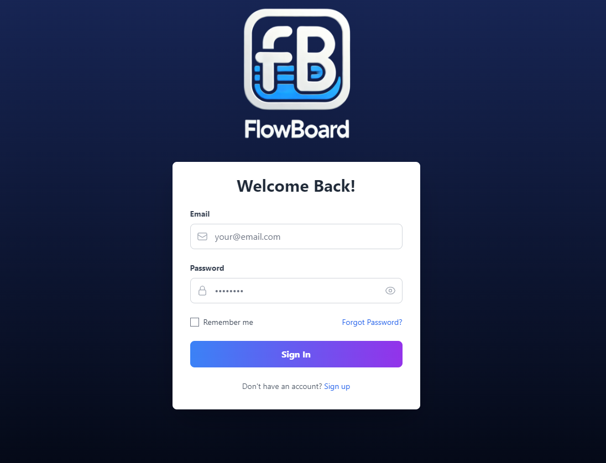
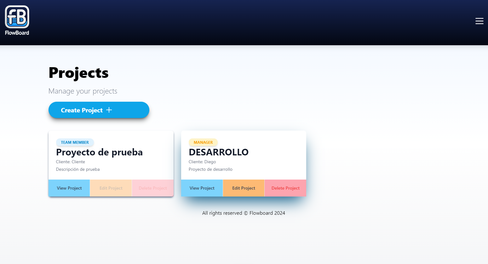
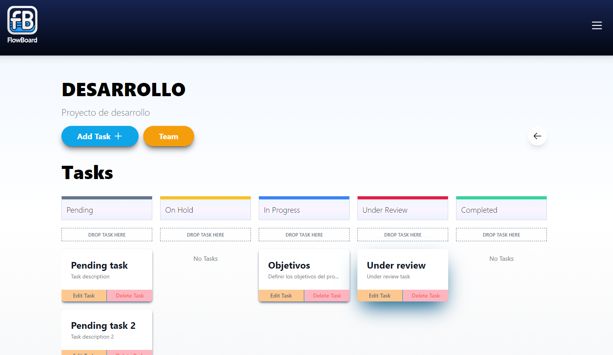
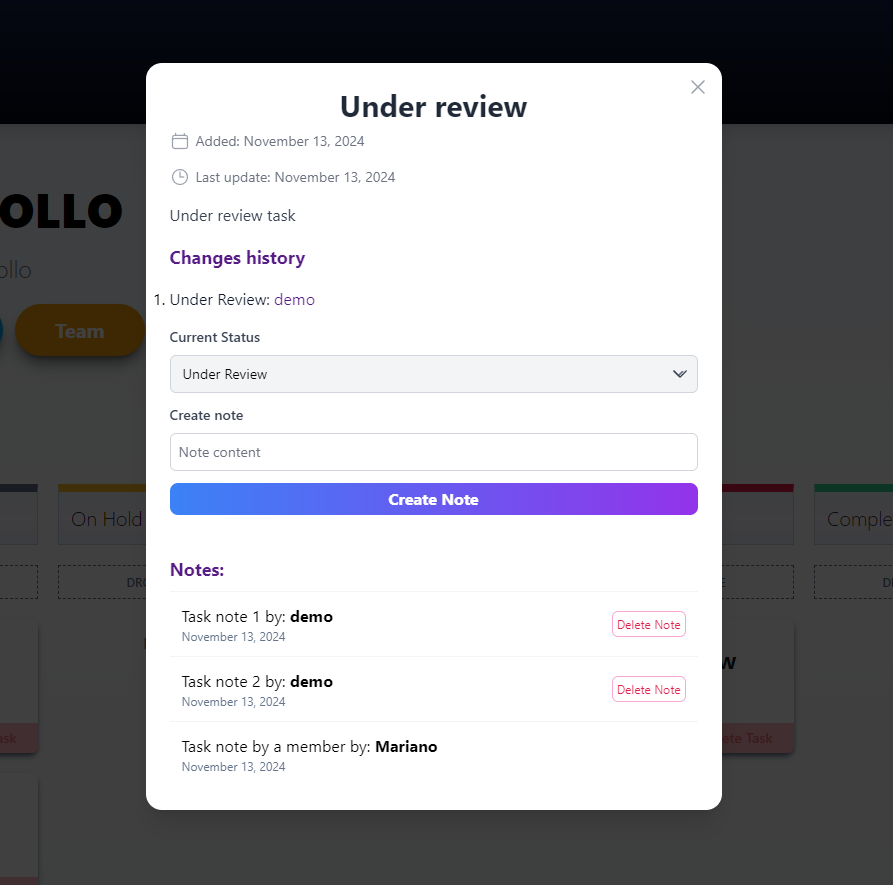
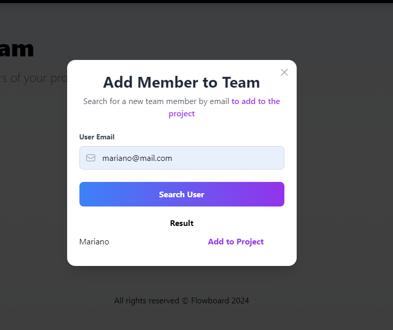

# 📝 Project Manager Frontend

Bienvenido a **Project Manager**, una aplicación web intuitiva y colaborativa similar a **Trello**. Permite gestionar proyectos y tareas con funcionalidades avanzadas de control de estados, permisos y colaboración entre miembros del equipo.

## 🚀 Descripción

**Project Manager** es una herramienta que facilita la creación y gestión de proyectos, asignación de miembros, creación de tareas con diferentes estados y la adición de notas dentro de cada tarea. Los usuarios pueden visualizar un historial detallado de cambios, incluyendo qué usuario realizó modificaciones. La gestión de permisos está implementada para que solo los managers puedan eliminar tareas o proyectos.

## ✨ Características principales

- **Gestión de Proyectos**: Crear, ver y gestionar múltiples proyectos.
- **Asignación de Miembros**: Añadir y gestionar miembros en cada proyecto.
- **Gestión de Tareas**:
  - Crear tareas con estados personalizados.
  - Ver y modificar el historial de cambios de estado.
- **Notas**: Agregar y visualizar notas dentro de cada tarea.
- **Historial de Modificaciones**: Ver quién y cuándo se realizaron cambios en tareas y notas.
- **Control de Permisos**: Solo los managers pueden eliminar proyectos y tareas.

## 🛠️ Tecnologías utilizadas

A continuación se detallan las principales tecnologías utilizadas en la construcción del frontend de la aplicación:

| Tecnología | Descripción |
|------------|-------------|
|  | Biblioteca para la construcción de interfaces de usuario |
|  | Lenguaje de programación para mejorar la calidad del código con tipado estático |
|  | Manejo de datos remotos y caching |
|  | Validación y parsing de esquemas de datos |
|  | Cliente HTTP para realizar peticiones al backend |
|  | Framework de CSS para un diseño responsivo y estilizado |
|  | Biblioteca para mostrar notificaciones y mensajes en la UI |

## ⚙️ Instalación

1. Clona este repositorio:
   ```bash
   git clone https://github.com/usuario/project-manager-frontend.git
2. Navega al directorio del proyecto:
   ```bash
   cd project-manager-frontend
3. Instala las dependencias:
   ```bash
   npm install
4. Inicia la aplicación:
   ```bash
   npm start

## 📸 Capturas de pantalla

_Pantalla de inicio de sesión_
<p align="center">
  
</p>

_Pantalla de inicio de la aplicación_
<p align="center">
  
</p>

_Pantalla de listado de tareas_
<p align="center">
  
</p>

_Vista de la tarea_
<p align="center">
  
</p>

_Vista para buscar y agregar un miembro al proyecto_
<p align="center">
  
</p>


## 📄 Licencia

Este proyecto está licenciado bajo la Licencia MIT. Puedes revisar el archivo `LICENSE` incluido en el repositorio para obtener más detalles.

## 🤝 Contribución

Las contribuciones son bienvenidas y apreciadas. Si deseas contribuir, por favor sigue los siguientes pasos:

1. Haz un fork del proyecto.
2. Crea una rama para tu función (`git checkout -b feature/nueva-funcion`).
3. Realiza los cambios y haz commit (`git commit -m 'Añadida nueva función'`).
4. Haz push a la rama (`git push origin feature/nueva-funcion`).
5. Abre un pull request para revisar tus cambios.

## 📝 Contacto

Si tienes preguntas, sugerencias o comentarios, no dudes en ponerte en contacto a través de:

- **Correo electrónico**: [mariano.koci@gmail.com](mailto:mariano.koci@gmail.com)
- **LinkedIn**: [Mariano Koci](https://www.linkedin.com/in/mkoci/)

## 💡 Agradecimientos

Agradecimientos a todos los colaboradores y a las bibliotecas de código abierto que hacen posible el desarrollo de este proyecto.
